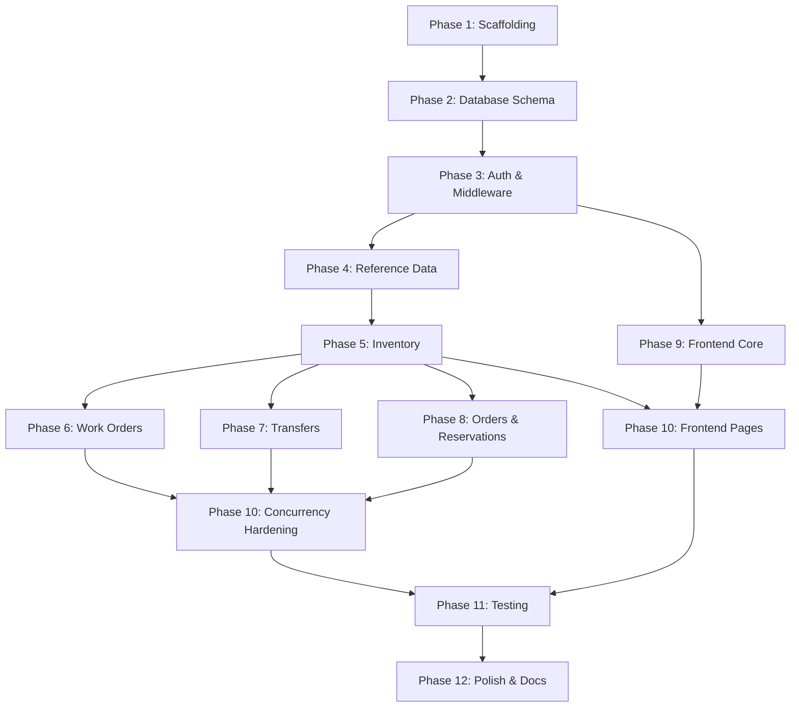

# Mini Operations ERP — Implementation Plan

## 1. Specification Analysis & Flaws Found

After carefully studying all 1717 lines of the [technical specification](file:///c:/Users/gopik/OneDrive/Desktop/mini-crp/Mini_Operations_ERP_Technical_Specification.md), I identified the following issues, gaps, and design concerns:

### 🔴 Critical Flaws

| # | Issue | Where | Impact | Recommended Fix |
|:--|:------|:------|:-------|:----------------|
| F1 | **Prisma does not support `GENERATED ALWAYS AS ... STORED` columns natively.** The spec (§14.1) recommends a Postgres generated column for `available_quantity`, but Prisma has no first-class support for generated columns — you can't declare them in `schema.prisma`. You'll need raw SQL migrations (`prisma migrate --create-only` + manual edit) and mark the field `@ignore` or use `@@ignore` workarounds. | §14.1, §15.8 | High — core data integrity mechanism. If naively attempted, migration will fail or the field won't be accessible. | Use `prisma migrate --create-only`, manually add the `GENERATED` column in SQL, and use `@default(0)` + `@map` or a DB view. Alternatively, compute `available` in a Postgres view and map Prisma to that. |
| F2 | **`SELECT ... FOR UPDATE` is not directly supported in Prisma's query builder.** The spec (§22.1) relies heavily on pessimistic row locking, but Prisma's standard API doesn't expose `FOR UPDATE`. You must use `prisma.$queryRaw` or the interactive transaction API with raw SQL. | §21, §22 | High — the entire concurrency strategy depends on this. | Use `prisma.$queryRawUnsafe` inside interactive transactions for lock-acquiring reads, then standard Prisma for the update. |
| F3 | **`CHECK` constraints are not supported in Prisma schema declarations.** The spec uses `CHECK (available_quantity >= 0)`, `CHECK (quantity > 0)`, `CHECK (source <> destination)` etc. extensively. These cannot be declared in `schema.prisma`. | §15.8, §15.11, §15.10 | Medium — constraints must be added via raw migration SQL. Without them, the "database as last line of defense" guarantee is absent. | Add all `CHECK` constraints in manual migration SQL after `prisma migrate --create-only`. |
| F4 | **Transfer creation validates quantity ≤ available, but stock can change before dispatch.** The spec acknowledges this (re-check at dispatch time) but the **creation-time check is misleading UX** — a user creates a transfer thinking stock is sufficient, but by the time they dispatch, it may not be. The spec says "transfer stays Requested" on dispatch failure, but doesn't specify how the user discovers this or recovers. | §23.2, §17.4 | Medium — UX gap for failed dispatch. | Add a clear UI state: show a "Cannot dispatch — insufficient stock" inline error on the transfer row, with the current available quantity, and a link to refresh/check. |

### 🟡 Design Concerns & Gaps

| # | Issue | Where | Notes |
|:--|:------|:------|:------|
| G1 | **No password-reset flow.** The spec covers login, refresh, and logout but has zero mention of "forgot password." Acceptable for a case study, but noted. | §4.2 | Leave out — explicitly out of scope for a case study. |
| G2 | **Seed data creates "one user per role" — how does Admin create Operations Users?** There's no user management UI specified beyond "Admin can view users / manage roles" (§4.1), but no CRUD endpoint for creating users is defined in §17. | §4.1, §13.3 | Add a `POST /users` endpoint (Admin-only) and a simple user-creation form, OR rely entirely on seed data. I recommend adding basic user CRUD since the spec says Admin can "manage roles." |
| G3 | **The `POST /orders/:id/reserve` accepts `{ orderItemId }` — one line at a time.** For a multi-line order, the UI must call this N times sequentially. If line 2 fails, lines 1 and 3 are already reserved. The spec acknowledges this (`PARTIALLY_RESERVED` status) but the **UX for "Reserve All" is clunky** — it's N sequential API calls with possible partial failure. | §17.5 | Acceptable for the case study's correctness requirement (one row lock per call = simple concurrency). Keep as-is. |
| G4 | **`customer_order_items.batch_id` is required** (§15.13) but the "Create Order" form (§9.5) doesn't mention batch selection. | §9.5, §15.13 | Default to the item's `DEFAULT` batch (same as inventory creation), and hide batch selection unless the item has multiple batches. |
| G5 | **No pagination for dropdown data.** The spec uses "searchable select" for items (§9.2), but doesn't define an API for searching items with autocomplete. If there are thousands of items, loading all into a dropdown is impractical. | §9.2 | Add `GET /items?search=&limit=20` as a lightweight autocomplete endpoint. |
| G6 | **The spec says Tailwind CSS but also defines a custom color system (§7.3).** These are redundant — Tailwind has its own color scale. Need to configure Tailwind's `theme.extend.colors` to match the spec's tokens. | §7.3 vs §30 | Configure Tailwind theme with the spec's exact color tokens. |
| G7 | **OpenAPI spec (`openapi.yaml`) is listed but must be hand-written.** No auto-generation from code. At 15+ endpoints with full request/response schemas, this is significant work. | §13.2, §36 | Write it after the API is stable, not before. Use Swagger JSDoc comments to auto-generate if possible. |

### 🟢 Positive Observations

- The spec is **exceptionally thorough** — state machines, concurrency worked examples, error code tables, and traceability matrix are all production-grade.
- The extensibility design (§35) is elegant — `RELEASED` enum values pre-seeded, `location_id` on users pre-added, open `transaction_type` strings.
- The decision to use a Postgres generated column for `available_quantity` is correct engineering — it eliminates an entire class of bugs. The Prisma incompatibility (F1) is just an implementation hurdle, not a design flaw.
- The pessimistic locking strategy (§22) is the right choice for this problem shape.

---

## 2. Step-by-Step Implementation Plan

### Phase 1: Project Scaffolding & Infrastructure (Day 1)

#### Step 1.1 — Initialize Monorepo Structure
- Create `mini-ops-erp/` root directory
- Create `frontend/`, `backend/`, `docs/` directories
- Initialize root `package.json` (for shared scripts)
- Set up ESLint + Prettier with shared config
- Create `.gitignore`, `.editorconfig`
- **First commit:** `chore: initialize monorepo structure`

#### Step 1.2 — Docker Compose Setup
- Create `docker-compose.yml` with:
  - PostgreSQL 16 service (port 5432, volume-mounted data)
  - Backend service (Node.js, port 4000)
  - Frontend service (Vite dev server, port 5173)
- Create `.env.example` with all variables from §29
- **Commit:** `chore: add Docker Compose for local development`

#### Step 1.3 — Backend Initialization
- `npx -y create-vite-app@latest` — NO, this is backend. Use:
  - `npm init -y` in `backend/`
  - Install core deps: `express`, `typescript`, `prisma`, `@prisma/client`, `jsonwebtoken`, `bcryptjs`, `zod`, `pino`, `pino-pretty`, `helmet`, `cors`, `express-rate-limit`, `cookie-parser`
  - Install dev deps: `@types/express`, `@types/jsonwebtoken`, `@types/bcryptjs`, `@types/cookie-parser`, `vitest`, `supertest`, `@types/supertest`, `tsx`, `nodemon`
  - Configure `tsconfig.json` (strict: true, paths)
  - Create folder structure per §13.2
  - Create `src/server.ts` (entrypoint), `src/app.ts` (Express assembly)
  - Create `src/config/index.ts` — Zod-validated env loading (fail-fast)
- **Commit:** `chore: scaffold backend with Express + TypeScript`

#### Step 1.4 — Frontend Initialization
- `npx -y create-vite@latest ./ --template react-ts` in `frontend/`
- Install deps: `react-router-dom`, `@tanstack/react-query`, `react-hook-form`, `@hookform/resolvers`, `zod`, `axios`
- Install Tailwind CSS (v3): `tailwindcss`, `postcss`, `autoprefixer`
- Configure Tailwind with the spec's color tokens (§7.3) in `tailwind.config.js`
- Create folder structure per §8.3
- **Commit:** `chore: scaffold frontend with React + Vite + Tailwind`

---

### Phase 2: Database Schema & Migrations (Day 1-2)

#### Step 2.1 — Prisma Schema
- Initialize Prisma: `npx prisma init`
- Write `prisma/schema.prisma` with all 12 tables from §15:
  - `roles`, `users`, `refresh_tokens`, `locations`, `categories`, `items`, `batches`, `inventory`, `inventory_transactions`, `work_orders`, `internal_transfers`, `customer_orders`, `customer_order_items`, `reservations`
- Note: `available_quantity` cannot be declared as `GENERATED` in Prisma — leave it as a regular field with `@default(0)` for now

#### Step 2.2 — Manual Migration for Constraints
- Run `npx prisma migrate dev --create-only --name init`
- **Manually edit** the generated SQL migration to add:
  - `GENERATED ALWAYS AS (physical_quantity - reserved_quantity) STORED` on `inventory.available_quantity`
  - All `CHECK` constraints (non-negative quantities, `source <> destination`, valid status enums, `quantity > 0`)
- Run `npx prisma migrate dev` to apply
- **Commit:** `feat: add database schema with CHECK constraints and generated columns`

#### Step 2.3 — Seed Data
- Write `prisma/seed.ts`:
  - 3 roles: ADMIN, OPERATIONS, SALES
  - 3 users (one per role) with bcrypt-hashed passwords
  - 2 locations (e.g., "Warehouse A", "Warehouse B")
  - 3 categories
  - 5 items (with DEFAULT batches auto-created)
  - Initial inventory records (enough to demo the full flow)
- Configure `prisma` seed command in `package.json`
- **Commit:** `feat: add seed data for demo and testing`

---

### Phase 3: Authentication & Authorization (Day 2-3)

#### Step 3.1 — Auth Module (Backend)
- `src/modules/auth/`:
  - `auth.schemas.ts` — Zod schemas for login, refresh
  - `auth.service.ts` — `login()`, `refresh()`, `logout()` with bcrypt + JWT + refresh token rotation
  - `auth.controller.ts` — thin request/response shaping
  - `auth.routes.ts` — `POST /login`, `POST /refresh`, `POST /logout`, `GET /me`
- `src/lib/jwt.ts` — sign/verify helpers
- `src/lib/errors.ts` — typed error classes (`ValidationError`, `NotFoundError`, `ConflictError`, `ForbiddenError`, `UnauthenticatedError`)
- **Commit:** `feat: implement authentication (login, JWT, refresh token rotation, logout)`

#### Step 3.2 — Middleware
- `src/middleware/authenticate.ts` — verify JWT, attach `req.user`
- `src/middleware/authorize.ts` — `authorize(...roles)` factory
- `src/middleware/validate.ts` — Zod schema validation middleware
- `src/middleware/errorHandler.ts` — global error handler mapping typed errors to §24 format
- `src/middleware/requestId.ts` — UUID per request + `X-Request-Id` header
- **Commit:** `feat: add authentication, authorization, and validation middleware`

#### Step 3.3 — Rate Limiting
- Apply `express-rate-limit` to `/auth/login` (10 attempts / 15 min / IP)
- **Commit:** `feat: add rate limiting on login endpoint`

---

### Phase 4: Reference Data Modules (Day 3)

#### Step 4.1 — Users Module
- `GET /users` (Admin) — list users with role info
- `GET /users/:id` (Admin)
- `POST /users` (Admin) — create user with role assignment
- **Commit:** `feat: add user management endpoints (Admin)`

#### Step 4.2 — Locations Module
- `GET /locations` (any), `POST /locations` (Operations), `PATCH /locations/:id` (Operations)
- **Commit:** `feat: add location CRUD endpoints`

#### Step 4.3 — Categories Module
- `GET /categories` (any), `POST /categories` (Operations)
- **Commit:** `feat: add category CRUD endpoints`

#### Step 4.4 — Items Module
- `GET /items` (any, with search/pagination), `POST /items` (Operations), `PATCH /items/:id` (Operations)
- Auto-create DEFAULT batch on item creation
- **Commit:** `feat: add item CRUD endpoints with auto-batch creation`

#### Step 4.5 — Batches Module
- `GET /batches?itemId=` (any), `POST /batches` (Operations)
- **Commit:** `feat: add batch endpoints`

---

### Phase 5: Inventory Module (Day 3-4)

#### Step 5.1 — Inventory Service & Endpoints
- `GET /inventory` — paginated, filterable (location, category, search), sortable
- `GET /inventory/:id` — single record with item/location/batch details
- `POST /inventory` — create new item/location/batch record (Operations)
- `PATCH /inventory/:id` — stock adjustment with:
  - `quantityChange`, `reason` (RECEIPT | ADJUSTMENT), `idempotencyKey`
  - Inside transaction: lock row → validate → update `physical_quantity` → write `inventory_transactions` audit row
  - Idempotency key check (unique index)
- `GET /inventory/:id/transactions` — paginated audit history
- **Commit:** `feat: implement inventory management with audit trail and idempotency`

#### Step 5.2 — Inventory Transaction Service
- All audit-trail reads, paginated
- **Commit:** `feat: add inventory transaction history endpoint`

---

### Phase 6: Work Orders Module (Day 4-5)

#### Step 6.1 — Work Order Service
- `POST /work-orders` (Admin) — validate assignee has OPERATIONS role
- `GET /work-orders` — paginated, filterable (status, location, assignedUser)
- `PATCH /work-orders/:id/status` — state machine enforcement:
  - ASSIGNED → IN_PROGRESS (only assignee)
  - IN_PROGRESS → COMPLETED (only assignee)
  - All other transitions → `409 INVALID_STATUS_TRANSITION`
  - Non-assignee → `403 NOT_ASSIGNED_TO_WORK_ORDER`
  - Uses `FOR UPDATE` to prevent race conditions on status
- **Commit:** `feat: implement work orders with status state machine`

#### Step 6.2 — Stock Check Service
- `GET /work-orders/:id/stock-check`
- Reads inventory for the WO's item at the WO's location
- Returns `{ requiredQuantity, availableQuantity, shortage: max(0, required - available) }`
- **Commit:** `feat: add material stock check with shortage calculation`

---

### Phase 7: Internal Transfers Module (Day 5-6)

#### Step 7.1 — Transfer Service
- `POST /transfers` (Operations) — validate source ≠ destination, quantity ≤ available at source
- `GET /transfers` — paginated, filterable
- `PATCH /transfers/:id/dispatch`:
  - Transaction: lock transfer row + source inventory row
  - Validate status = REQUESTED, available ≥ quantity
  - Decrement source `physical_quantity`
  - Update transfer status → DISPATCHED, set `dispatched_by`, `dispatched_at`
  - Write `TRANSFER_OUT` audit row
- `PATCH /transfers/:id/receive`:
  - Transaction: lock transfer row
  - Conditional update WHERE status = 'DISPATCHED'
  - 0 rows affected → `409 TRANSFER_ALREADY_RECEIVED`
  - Create destination inventory record if missing (upsert)
  - Increment destination `physical_quantity`
  - Update transfer → RECEIVED, set `received_by`, `received_at`
  - Write `TRANSFER_IN` audit row
- **Commit:** `feat: implement internal transfers with dispatch/receive and row locking`

---

### Phase 8: Customer Orders & Reservations (Day 6-7)

#### Step 8.1 — Customer Order Service
- `POST /orders` (Sales) — create order header + line items (all PENDING)
- `GET /orders` — paginated, filterable
- `GET /orders/:id` — full order with line items and reservation status
- **Commit:** `feat: implement customer order creation with line items`

#### Step 8.2 — Reservation Service
- `POST /orders/:id/reserve` — body: `{ orderItemId }`
  - Transaction: lock inventory row (`FOR UPDATE`)
  - Re-read `available_quantity` under lock
  - Validate available ≥ requested
  - Increment `reserved_quantity`
  - Insert `reservations` row (status ACTIVE)
  - Write `RESERVATION` audit row
  - Update order item status → RESERVED
  - Update order header status (PENDING → PARTIALLY_RESERVED or RESERVED based on all lines)
  - On failure: `409 INSUFFICIENT_STOCK` with current available quantity in `details`
- **Commit:** `feat: implement concurrency-safe stock reservation with row locking`

---

### Phase 9: Frontend — Core Layout & Auth (Day 7-8)

#### Step 9.1 — Design System & Layout
- Configure Tailwind with spec color tokens
- Build UI components: `Button`, `Input`, `Select`, `Modal`, `ConfirmationDialog`, `Toast/ToastProvider`, `Badge/StatusBadge`, `DataTable`, `Pagination`, `SearchBar`, `FilterPanel`, `LoadingSkeleton`, `EmptyState`, `ErrorState`, `FormField`, `QuantityInput`
- Build layout components: `AppShell`, `Sidebar` (role-filtered nav), `Topbar`
- **Commit:** `feat: build design system and layout shell`

#### Step 9.2 — Auth & Routing
- `api/client.ts` — Axios instance with Bearer token interceptor + 401→refresh logic
- `api/auth.ts` — login, logout, refresh, me
- `AuthContext` — user state, token management in memory
- `ProtectedRoute` + `RoleGuard` wrappers
- Route definitions per §8.4
- Login page (§9.1)
- **Commit:** `feat: implement auth flow, protected routing, and login page`

---

### Phase 10: Frontend — Feature Pages (Day 8-11)

#### Step 10.1 — Inventory Page (§9.2)
- Table with Physical/Reserved/Available, filters, pagination
- "Add/Adjust Stock" modal (Operations only)
- `StockAvailabilityIndicator` component
- Transaction history drawer
- **Commit:** `feat: build inventory management page`

#### Step 10.2 — Work Orders Page (§9.3)
- Table with status badges, filters
- "Create Work Order" modal (Admin)
- Stock Check drawer with shortage display
- Status transition buttons with confirmation dialogs
- "Create Transfer from shortage" shortcut
- **Commit:** `feat: build work orders page with stock check`

#### Step 10.3 — Internal Transfers Page (§9.4)
- Table with status badges, filters
- "Create Transfer" modal with live "available at source" hint
- Dispatch/Receive buttons with confirmation dialogs
- Handle `409 TRANSFER_ALREADY_RECEIVED` gracefully
- **Commit:** `feat: build internal transfers page`

#### Step 10.4 — Customer Orders Page (§9.5)
- Table with status, filters
- "Create Order" modal with multi-line items
- Per-line "Reserve" button
- Inline conflict error handling for `409 INSUFFICIENT_STOCK`
- **Commit:** `feat: build customer orders page with reservation UI`

---

### Phase 11: Testing (Day 11-13)

#### Step 11.1 — Backend Unit Tests
- Service-layer tests with mocked repositories
- Shortage calculation (T-10)
- State machine validation (T-11)
- **Commit:** `test: add unit tests for service layer business logic`

#### Step 11.2 — Backend Integration Tests (Real DB)
- T-01: Cannot reserve more than available
- T-02: Cannot transfer more than available
- T-03: Destination increases only after receipt
- T-04: Same transfer cannot be received twice
- T-05: Unauthorized user blocked
- T-06: Concurrent reservations cannot jointly oversell (parallel DB connections)
- T-07: Available always equals physical − reserved
- T-08: Negative inventory rejected
- T-09: Duplicate transaction rejected
- T-12: Non-assignee cannot advance work order
- T-13: Transfer source ≠ destination enforced
- **Commit:** `test: add integration tests including concurrency scenarios`

#### Step 11.3 — Frontend Tests
- T-14: Reserve button disabled after reservation
- T-15: Reservation conflict error surfaces inline
- Component tests for status badges, forms, tables
- **Commit:** `test: add frontend component and integration tests`

#### Step 11.4 — E2E Test
- T-16: Full happy-path flow with Playwright
- Login → Inventory → WO → Stock Check → Transfer (dispatch+receive) → Order → Reserve
- **Commit:** `test: add end-to-end happy path test`

---

### Phase 12: Polish, Docs & Submission (Day 13-14)

#### Step 12.1 — Health Check & Observability
- `GET /health` endpoint (no auth)
- Structured logging with pino (request ID, method, path, duration)
- Graceful shutdown on SIGTERM/SIGINT
- **Commit:** `feat: add health check, structured logging, graceful shutdown`

#### Step 12.2 — API Documentation
- Write/generate `openapi.yaml`
- Serve Swagger UI at `/docs` (non-production only)
- **Commit:** `docs: add OpenAPI specification and Swagger UI`

#### Step 12.3 — README & Documentation
- Setup instructions, env vars table, how to run (dev + Docker), how to test
- ER diagram export
- Demo video recording (5-7 min, flow per §36.2)
- **Commit:** `docs: add README, ER diagram, and demo video`

#### Step 12.4 — Final Review
- Run full test suite
- Docker Compose end-to-end validation
- Git history review (incremental, conventional commits)
- **Commit:** `chore: final review and cleanup`

---

## 3. Dependency Graph

---

## 4. Risk Register

| Risk | Probability | Impact | Mitigation |
|:-----|:-----------|:-------|:-----------|
| Prisma generated column incompatibility (F1) | High | High | Plan for manual migration SQL from day 1; test early |
| `FOR UPDATE` raw SQL complexity (F2) | High | High | Write a reusable `lockRow()` utility function wrapping `$queryRaw` |
| Concurrency test flakiness | Medium | Medium | Use deterministic test setup with explicit transaction ordering; don't rely on timing |
| Tailwind + custom color system conflict (G6) | Low | Low | Configure once in `tailwind.config.js`, done |
| Scope creep from "nice-to-have" features | Medium | High | Strictly follow the spec's "out of scope" list (§2); resist adding anything not mentioned |
| Time estimate overrun on frontend | Medium | Medium | Start frontend work in parallel using MSW mocks from Phase 5 onward |

---

## 5. Estimated Timeline

| Phase | Duration | Cumulative |
|:------|:---------|:-----------|
| Phase 1: Scaffolding | 0.5 day | 0.5 day |
| Phase 2: Database | 1 day | 1.5 days |
| Phase 3: Auth | 1.5 days | 3 days |
| Phase 4: Reference Data | 0.5 day | 3.5 days |
| Phase 5: Inventory | 1.5 days | 5 days |
| Phase 6: Work Orders | 1 day | 6 days |
| Phase 7: Transfers | 1.5 days | 7.5 days |
| Phase 8: Orders & Reservations | 1.5 days | 9 days |
| Phase 9: Frontend Core | 2 days | 11 days |
| Phase 10: Frontend Pages | 3 days | 14 days |
| Phase 11: Testing | 2.5 days | 16.5 days |
| Phase 12: Polish & Docs | 1.5 days | 18 days |

> [!IMPORTANT]
> **Total estimated time: ~18 working days (3.5 weeks).** Frontend work (Phases 9-10) can start in parallel with backend work from Phase 5 onward using MSW mocks, potentially reducing to ~14 days.

---

## Open Questions

> [!IMPORTANT]
> Please review these before I begin implementation:

1. **User Management:** The spec says Admin can "view users / manage roles" but defines no user CRUD API. Should I add a basic `POST /users` endpoint for Admin to create users, or should all users come from seed data only?

2. **Batch Selection in Orders:** The spec requires `batch_id` on `customer_order_items` but the Create Order form doesn't mention batch selection. Should I auto-default to the `DEFAULT` batch and hide batch selection?

3. **Deployment Target:** The spec mentions Docker Compose. Are you planning to deploy this somewhere specific (Render, Railway, AWS, etc.) or is Docker Compose on localhost sufficient?

4. **Testing Database:** For integration/concurrency tests, should I use Docker Testcontainers (auto-spins a Postgres container per test run) or connect to the Docker Compose Postgres with a separate test database?

5. **Timeline/Priorities:** The full implementation is ~18 days. Would you like me to prioritize backend-first (all APIs complete and tested before any frontend), or build vertically module-by-module (backend + frontend for inventory, then backend + frontend for work orders, etc.)?
